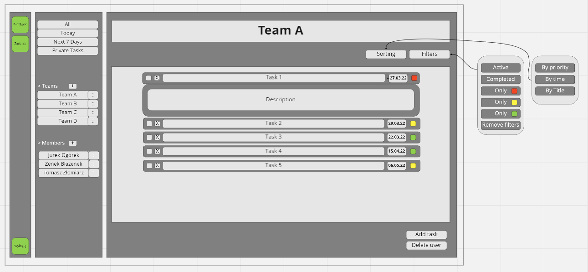
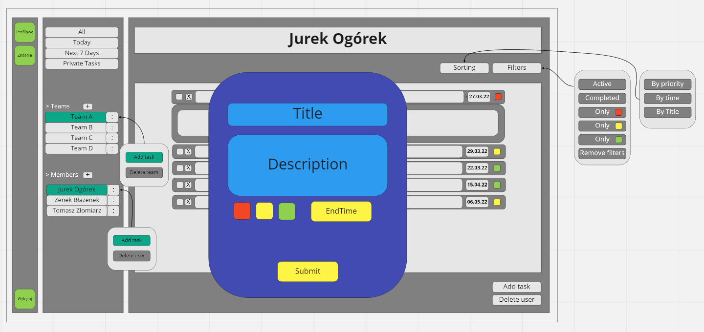

# PAP22L-Z04 - Projekt *TDL Tasks* (ToDoList)

Projekt ma na celu zbudowanie webowej aplikacji ToDoList o nazwie ***TDL Tasks*** z dodatkową funkcjonalnością podziału na grupy/zespoły. <br>
Projekt jest realizowny w ramach przedmiotu PAP.

# Zespół Z04:
- *Yaroslav Harbar*
- *Adam Dąbkowski*
- *Adam Wróblewski*

<br>

# Wymagania funkcjonalne i niefunkcjonalne aplikacji

## Rejestracja, logowanie użytkowników:
- Możliwość rejestracji użytkowników wraz z aktywacją konta poprzez link wysłany drogą mailową.
- Logowanie użytkowniów przy użyciu maila użytkownika.

<br>

## Podział na role użytkowników (User, Team Leader, Admin):
- **User**: 
  - możliwość dodania zadania do prywatnej listy zadań (prywatną listę zadań widzi tylko dany użytkownik).
  - może przydzielić zadanie innemu użytkownikowi zarejestrowanemu w systemie.
  
<br>

- **Team-Leader**: 
  - ma wszystkie uprawnienia **Usera**.
  - może tworzyć/usuwać/edytować utworzony zespół.
  - może dodawać/usuwać użytkowników do/ze swojego zespołu.
  - może dodawć/usuwać zadania w ramach zespołu.

<br>

- **Admin**: 
  - ma wszystkie funkcjonalności **Usera** i **Team Leadera**.
  - zarządza użytkownikami - nadaje role, usuwa użytkowników z bazy danych.
  
<br>

## Zadania w liście zadań:
- Każde zadanie oprócz tytułu posiada krótki opis. Dodatkowo można określić termin wykonania zadania, a także je oflagować (określić priorytet).

<br>

## Podział zadań:
Zadania możemy podzielić według dwóch kryteriów:
- względem sposobu ich przydzielenia tzn. na zadania przydzielone przez:

    - **Team Leadera** w ramach zespołu
    - innego **Usera** niezależnie od zespołu
    - siebie samego 

<br>

- względem określonego priorytetu (przydzielonej flagi):

  - najwyższy priorytet (czerwona flaga)
  - średni priorytet (żółta flaga)
  - niski priorytet (zielona flaga)
  
<br>


# Technologie jakie będą wykorzystane w projekcie
## Back-end:
- [Java](https://docs.oracle.com/en/java/)
- [Maven](https://maven.apache.org/)
- [Spring Boot](https://spring.io/)
- [MySQL](https://www.mysql.com/)
## Front-end:
- [HTML](https://developer.mozilla.org/pl/docs/Web/HTML) ( + korzystanie z metodologii [BEM](https://en.bem.info/methodology/))
- [CSS](https://developer.mozilla.org/pl/docs/Web/CSS) (SCSS)
- [JS](https://developer.mozilla.org/pl/docs/Web/JavaScript)
- [Node.js](https://nodejs.org/en/docs/)
- [Bootstrap](https://getbootstrap.com/)
- [React](https://reactjs.org/)


<br>

# Priorytety podczas realizacji projektu
* Głównym celem projektu jest prawidłowe działanie aplikacji, która będzie umożliwiała korzystanie z wyżej wymienionych funkcjonalności.
* Istotne jest także samo zagospodarowanie okna przeglądarki tak, aby korzystanie z aplikacji odbywało się w sposób wygodny i intuicyjny. 
* Najmniej istotnym elementem jest sam design aplikacji (estetyka wykonania) tzn. dobór kolorów, czcionek, zastosowanie animacji.

<br>

# Warstwy aplikacji:
  <div align="center">
      
  </div>
<br>

# Główne encje/klasy projektu:
<div align="center">
    
</div>
<br>
Klasy te są automatycznie konwertowane przez Spring Boot na odpowiadające im tabele w bazie danych. Aby lepiej zwizualizować powiązania pomiędzy powyższymi encjami, pola typu danej encji są oznaczone tym samym kolorem co pole reprezentujące klasę.

<br>

W wyniku powiązań pomiędzy klasami generowane są następujące tabele w bazie danych:
* *application_user* - tabela przechowująca dane o użytkownikach
* *task* - tabela przechowująca dane o zadaniach
* *task_receivers* - tabela, w której zawarte są informacje dotyczące przypisania zadań do wykonania do poszczególnych użytkowników
* *team* -  tabela przechowująca dane o zespołach
* *teams_users* - tabela, w której zawarte są informacje dotyczące przypisania użytkowników do zespołów
* *token* - tabela zawierająca dane tokenów wykorzystywanych podczas rejestracji i weryfikacji mailowej

Dodatkowo tworzona jest tabela o nazwie *hibernate_sequence*

<br>

# Schematyczny wygląd aplikacji:
<div align="center">
    
</div>


<br/>
<br/>

<div align="center">
    
</div>

<br>

# Uruchomienie aplikacji:
Chcąc uruchomić aplikację, na początku należy sklonować branch *test_2* komendą:

```
git clone --single-branch --branch etap_2 https://gitlab-stud.elka.pw.edu.pl/adabkows/pap22l-z04.git
```

Należy mieć zainstalowaną Javę w wersji 17 oraz Maven oraz dodane odpowiednie zmienne środowiskowe pozwalające na wywołanie mavena oraz javy z poziomu konsoli.
Przykładowy tutorial instalacji Mavena i Javy: https://toolsqa.com/maven/how-to-install-maven-on-windows/
 
Następnie w konsoli przechodzimy do lokalizacji sklowanego projektu i uruchamiamy projekt komendą:
```
mvn spring-boot:run
```
Rezultaty pracy możemy obejrzeć w dowolnej przeglądarce przechodząc pod adres *http://localhost:8080/start*

<br>

# Aktualny stan realizacji projektu
Powyższe informacje dotyczą wersji programu omożliwiającej wygodne wykonywanie operacji nad zaimplementowanymi encjami. Jednocześnie w branchu *test* przeprowadzana jest refaktoryzacja kodu z wykorzystaniem Reacta. Istotną zmianą jest także zmiana sposobu zabezpieczania strony, która polega na zastosowaniu *JWT (JsonWebToken)*.