# PAP22L-Z04 - Projekt *TDL Tasks* (ToDoList)

Projekt ma na celu zbudowanie webowej aplikacji ToDoList o nazwie ***TDL Tasks*** z dodatkową funkcjonalnością podziału na grupy/zespoły. <br>
Projekt jest realizowny w ramach przedmiotu PAP.

# Zespół Z04:
- *Yaroslav Harbar*
- *Adam Dąbkowski*
- *Adam Wróblewski*


<br>

# Wymagania funkcjonalne i niefunkcjonalne aplikacji

## Rejestracja, logowanie użytkowników:
- Możliwość rejestracji użytkowników wraz z aktywacją konta poprzez link wysłany drogą mailową.
- Logowanie użytkowniów przy użyciu maila użytkownika.
- Możliwość zmiany hasła z wykorzystaniem linku wysłanego drogą mailową.

<br>

## Podział na role użytkowników (User, Team Leader, Admin):
- **User**: 
  - możliwość dodania zadania do prywatnej listy zadań (*prywatną listę zadań widzi tylko dany użytkownik*).
  - może przydzielić zadanie innemu użytkownikowi zarejestrowanemu w systemie (*zarówno w sekcji prywatnej jak i w ramach zespołu*), może także je usunąć.
  - posiada możliwość zmiany swoich danych (*imię, nazwisko, zdjęcie profilowe*).
  
  
<br>

- **Team-Leader**: 
  - ma wszystkie uprawnienia **Usera**.
  - może tworzyć/usuwać/edytować dane zespołu.
  - może dodawać/usuwać użytkowników do/ze swojego zespołu.

<br>

- **Admin**: 
  - ma wszystkie funkcjonalności **Usera** i **Team Leadera**.
  - zarządza użytkownikami - nadaje role.
  
<br>

## Zadania w liście zadań:
- Każde zadanie oprócz tytułu posiada krótki opis. Dodatkowo można określić termin wykonania zadania, a także je oflagować (określić priorytet).

<br>

## Podział zadań:
Zadania możemy podzielić według dwóch kryteriów:
- względem sposobu ich przydzielenia tzn. na zadania przydzielone:

    - w ramach zespołu
    - przez innego użytkownika niezależnie od zespołu
    - przez siebie samego 

<br>

- względem określonego priorytetu (przydzielonej flagi):

  - najwyższy priorytet (czerwona flaga)
  - średni priorytet (żółta flaga)
  - niski priorytet (zielona flaga)
  
<br>


# Technologie wykorzystane w projekcie
## Back-end:
- [Java](https://docs.oracle.com/en/java/)
- [Maven](https://maven.apache.org/)
- [Spring Boot](https://spring.io/)
- [MySQL](https://www.mysql.com/)
## Front-end:
- [HTML](https://developer.mozilla.org/pl/docs/Web/HTML) ( + korzystanie z metodologii [BEM](https://en.bem.info/methodology/))
- [CSS](https://developer.mozilla.org/pl/docs/Web/CSS) (SCSS)
- [JS](https://developer.mozilla.org/pl/docs/Web/JavaScript)
- [Node.js](https://nodejs.org/en/docs/)
- [Bootstrap](https://getbootstrap.com/)
- [React](https://reactjs.org/)


<br>

# Priorytety podczas realizacji projektu
* Głównym celem projektu jest prawidłowe działanie aplikacji, która będzie umożliwiała korzystanie z wyżej wymienionych funkcjonalności.
* Istotne jest także samo zagospodarowanie okna przeglądarki tak, aby korzystanie z aplikacji odbywało się w sposób wygodny i intuicyjny. 
* Najmniej istotnym elementem jest sam design aplikacji (estetyka wykonania) tzn. dobór kolorów, czcionek, zastosowanie animacji.

<br>

# Warstwy aplikacji:
  <div align="center">
      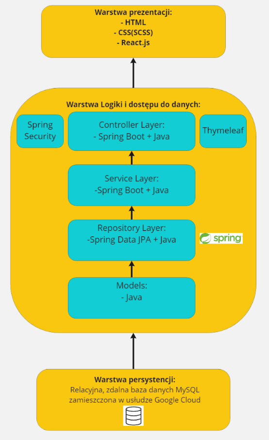
  </div>
<br>

# Główne encje/klasy projektu:
<div align="center">
    
</div>
<br>
Klasy te są automatycznie konwertowane przez Spring Boot na odpowiadające im tabele w bazie danych. Aby lepiej zwizualizować powiązania pomiędzy powyższymi encjami, pola typu danej encji są oznaczone tym samym kolorem co pole reprezentujące klasę.

<br>

W wyniku powiązań pomiędzy klasami generowane są następujące tabele w bazie danych:
* *application_user* - tabela przechowująca dane o użytkownikach
* *email_token* - tabela zawierająca dane tokenów wykorzystywanych podczas rejestracji, zmiany hasła i weryfikacji mailowej
* *image* - tabela zawierająca dane zdjęć profilowych
* *task* - tabela przechowująca dane o zadaniach
* *task_receivers* - tabela, w której zawarte są informacje dotyczące przypisania zadań do wykonania do poszczególnych użytkowników
* *task_receivers_who_done* - tabela, w której zawarte są informacje dotyczące stanu wykonania zadań przez poszczególnych użytkowników
* *team* -  tabela przechowująca dane o zespołach
* *teams_users* - tabela, w której zawarte są informacje dotyczące przypisania użytkowników do zespołów


Dodatkowo tworzona jest tabela o nazwie *hibernate_sequence*

<br>

# Wygląd aplikacji:

<div align="center">
    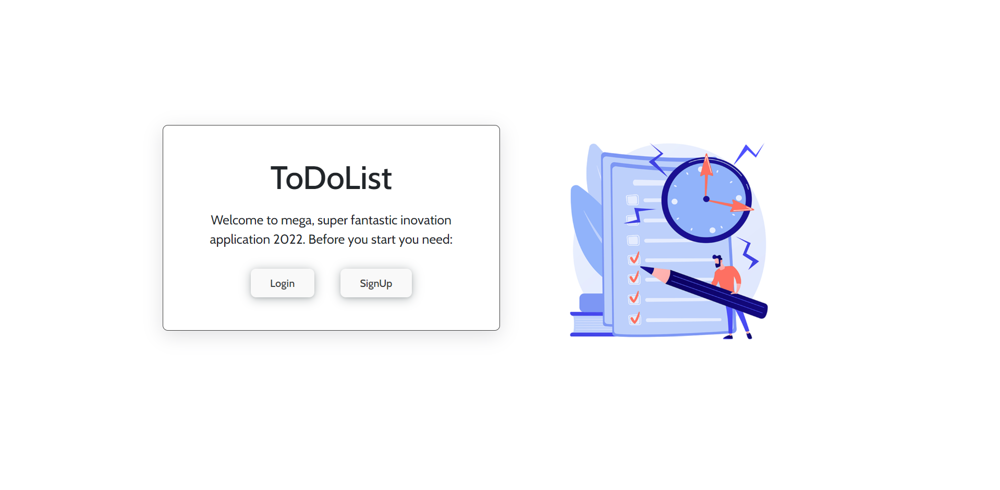
</div>

<div align="center">
   <i>Widok strony początkowej</i>
</div>

<br/>
<br/>

<div align="center">
    
</div>

<div align="center">
   <i>Widok strony głównej</i>
</div>

<br/>
<br/>

<div align="center">
    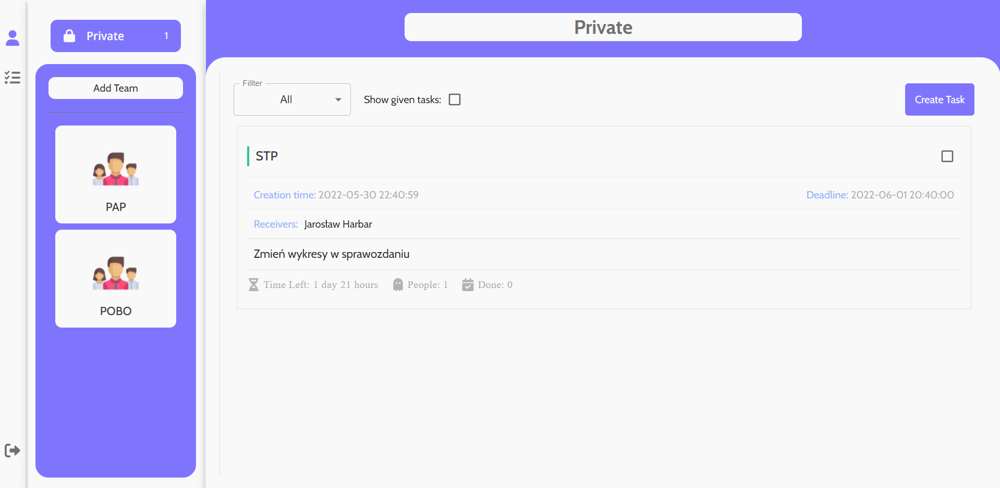
</div>

<div align="center">
   <i>Widok sekcji prywatnej</i>
</div>

<br/>
<br/>

<div align="center">
    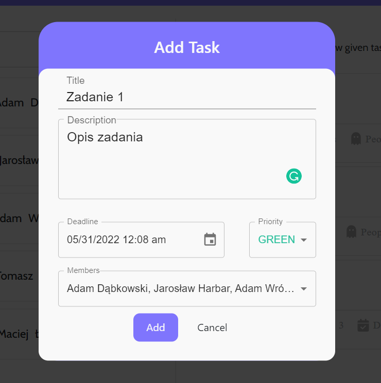
</div>

<div align="center">
   <i>Pole umożliwiające dodawanie zadania</i>
</div>

<br/>
<br/>

<div align="center">
  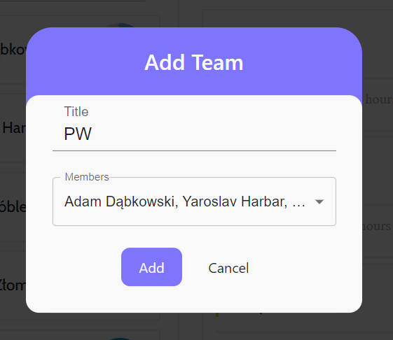
</div>

<div align="center">
   <i>Pole umożliwiające dodawanie zespołu</i>
</div>

<br/>
<br/>

<div align="center">
  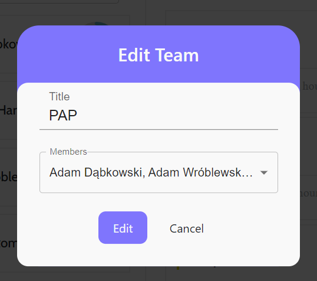
</div>

<div align="center">
   <i>Pole edycji zespołu</i>
</div>

<br/>
<br/>

<div align="center">
    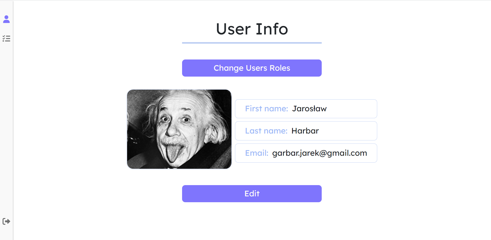
</div>

<div align="center">
   <i>Widok strony użytkownika</i>
</div>

<br/>
<br/>

<div align="center">
    
</div>

<div align="center">
   <i>Pole umożliwiające zmianę ról użytkowników</i>
</div>

<br/>
<br/>

<div align="center">
    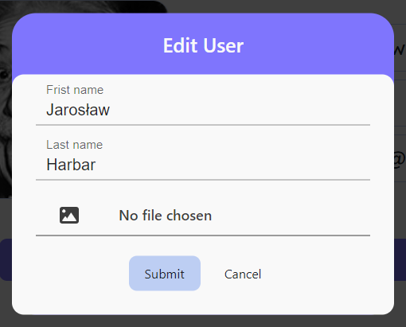
</div>

<div align="center">
   <i>Pole edycji użytkownika</i>
</div>

<br/>
<br/>

<div align="center">
    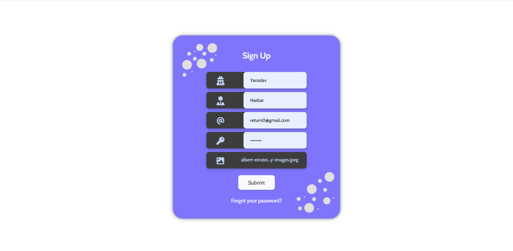
</div>

<div align="center">
   <i>Strona rejestracji</i>
</div>

<br/>
<br/>

<div align="center">
    
</div>

<div align="center">
   <i>Strona logowania</i>
</div>

<br/>
<br/>

<div align="center">
    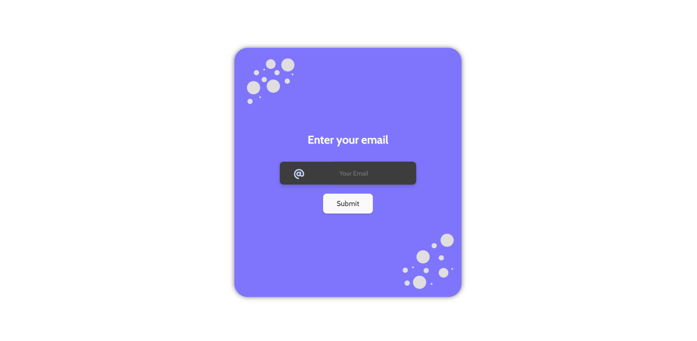
</div>

<div align="center">
   <i>Pole umożliwiające wysłanie linku na wskazany adres email umożliwiającego zresetowanie hasła</i>
</div>

<br/>
<br/>

<div align="center">
    
</div>

<div align="center">
   <i>Pole edycji hasła</i>
</div>

<br/>
<br/>

<div align="center">
    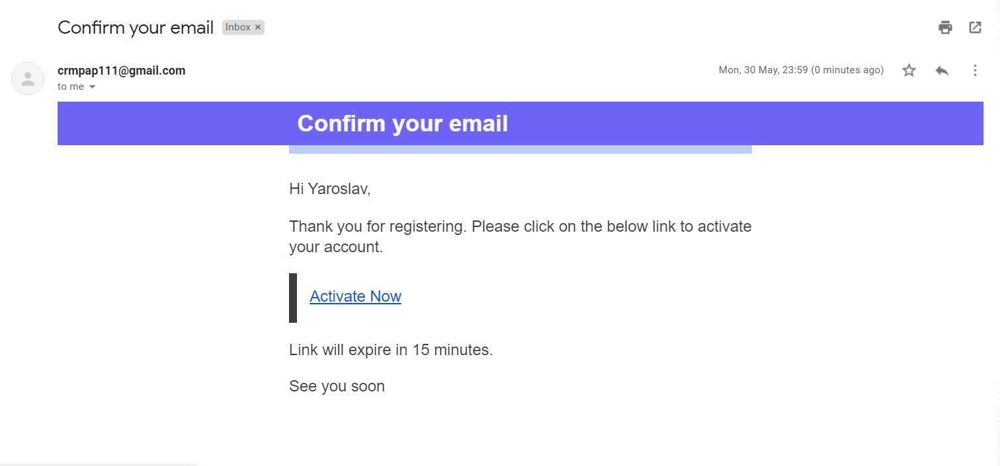
</div>

<div align="center">
   <i>Mail potwierdzający rejestrację użytkownika</i>
</div>

<br/>
<br/>

<div align="center">
    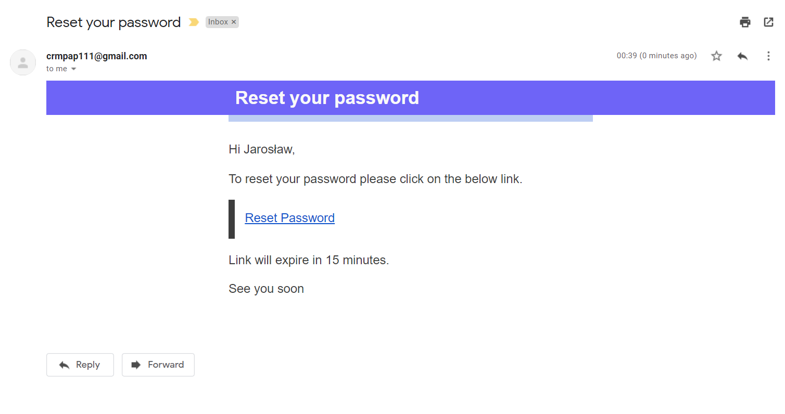
</div>

<div align="center">
   <i>Mail umożliwiający edycję hasła</i>
</div>
<br>

# Uruchomienie aplikacji:
Chcąc uruchomić aplikację, na początku należy sklonować branch *test_2* komendą:

```
git clone --single-branch --branch etap_2 https://gitlab-stud.elka.pw.edu.pl/adabkows/pap22l-z04.git
```
## Back-end

Należy mieć zainstalowaną Javę w wersji 17 oraz Maven oraz dodane odpowiednie zmienne środowiskowe pozwalające na wywołanie mavena oraz javy z poziomu konsoli.
Przykładowy tutorial instalacji Mavena i Javy: https://toolsqa.com/maven/how-to-install-maven-on-windows/
 
Następnie w konsoli przechodzimy do lokalizacji sklowanego projektu i uruchamiamy projekt komendą:
```
mvn spring-boot:run
```
W celu poprawnego skonfigurowania aplikacji (zainicjalizowania danych początkowych), aby uniknąć ingerencji w kod źródłowy, konieczne jest 3-krotne uruchomienie aplikacji. Po tym zabiegu możemy normalnie korzystać z aplikacji, która została skonfigurowana w sposób prawidłowy.
## Front-end

Przed uruchomieniem *React application* należy zaintalować node.js. Na początku otwieramy stronę: https://nodejs.org/en/ i pobieramy wersję *Recommended For Most Users*. Proces intalacji przebiega tak, jak w przypadku instalacji zwykłej aplikacji (bez dodatkowych zaznaczeń).  
Po zakończeniu instalacji należy otworzyć terminal i przejść do folderu *src/frontend*. Następnie wpisujemy komendę:
```
npm i
```
Za każdym razem naciskamy *Enter*.
<br>
Potem należy wpisać komendę:
```
npm install
```
W przypadku wystąpienia błędów należy skorzystać z komendy poniżej:
```
npm install --legacy-peer-deps
```

Po skończeniu instalacji pakietów npm, możemy już urochomić aplikację. W tym celu w terminalu wpisujemy komendę:
```
npm start
```
http://localhost:3000/

<br>
<br>

## Walidacja aplikacji:
W celu walidacji kodu back-endu aplikacji wykorzystaliśmy plugin Checkstyle, jego wyniki znajdują się w pliku [Checkstyle.html](checkstyle.html).

